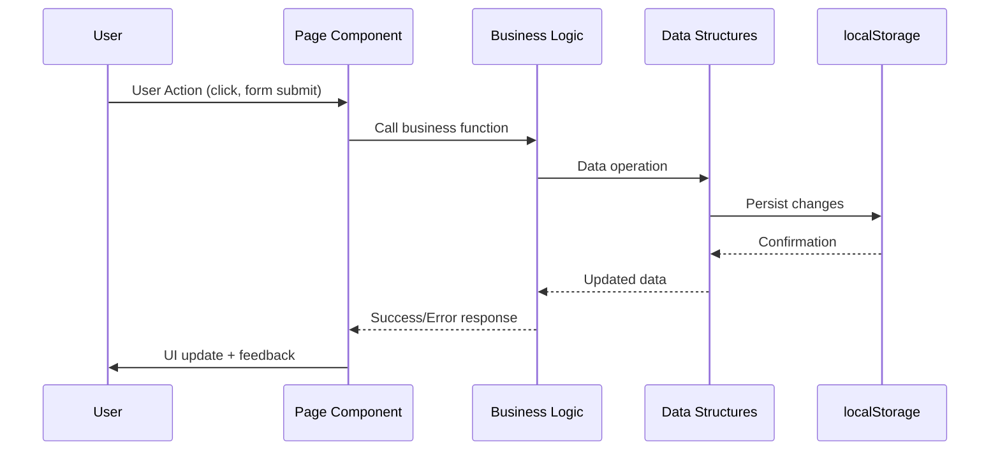

# Housekeeping Management System - System Architecture

## Overview
A comprehensive task management application demonstrating practical implementation of Data Structures and Algorithms (DSA) concepts in a real-world housekeeping management system.

```mermaid
graph TB
    %% User Interface Layer
    subgraph "User Interface Layer (React/Next.js)"
        subgraph "Pages"
            DASH[Dashboard<br/>/page.tsx<br/>- Worker Statistics<br/>- Task Overview<br/>- Real-time Metrics]
            ASSIGN[Assign Tasks<br/>/assign/page.tsx<br/>- Add Workers<br/>- Create Tasks<br/>- Immediate Assignment]
            TASKS[View Tasks<br/>/tasks/page.tsx<br/>- Advanced Filtering<br/>- Multi-sort Options<br/>- Bulk Operations]
        end

        subgraph "Components"
            NAV[Navigation.tsx<br/>- Route Navigation<br/>- Glass-morphism UI]
            WT[WorkerTable.tsx<br/>- Worker Display<br/>- Availability Toggle<br/>- Capacity Bars]
            TT[TaskTable.tsx<br/>- Task Management<br/>- Assignment Controls<br/>- Status Updates]
        end
    end

    %% Business Logic Layer
    subgraph "Business Logic Layer (TypeScript)"
        subgraph "Core Operations (lib/data.ts)"
            WM[Worker Management<br/>- addWorker()<br/>- updateWorkerAvailability()<br/>- getAvailableWorkers()]
            TM[Task Management<br/>- addTask()<br/>- assignTaskToWorker()<br/>- completeTask()<br/>- unassignTask()]
            DS[Data Persistence<br/>- initializeData()<br/>- saveData()<br/>- localStorage API]
        end

        subgraph "DSA Algorithms"
            SORT[Sorting Algorithms<br/>- sortTasksByPriority()<br/>  O(n log n)<br/>- sortTasksByDeadline()<br/>  O(n log n)]
            SEARCH[Search Algorithms<br/>- searchTasks()<br/>  O(n × m)<br/>- Multi-field substring search]
            FILTER[Filtering Algorithms<br/>- getAvailableWorkers()<br/>  O(n)<br/>- getUnassignedTasks()<br/>  O(n)]
            ASSIGN[Assignment Algorithm<br/>- Capacity-Constrained<br/>  O(n) lookup + O(1) update<br/>- 8-hour daily limit enforcement]
        end
    end

    %% Data Layer
    subgraph "Data Layer"
        subgraph "Core Data Structures"
            WA[Worker[] Array<br/>Dynamic storage<br/>O(1) append<br/>O(n) search]
            TA[Task[] Array<br/>Task collection<br/>O(n) operations]
            HM[Map&lt;string, Worker&gt;<br/>Hash Table<br/>O(1) lookups<br/>Worker ID → Worker]
            PW[Priority Weights<br/>Record&lt;Priority, number&gt;<br/>High: 3, Medium: 2, Low: 1<br/>O(1) access]
        end

        subgraph "Data Persistence"
            LS[(localStorage)<br/>Browser Storage<br/>5-10MB limit<br/>Client-side only]
        end
    end

    %% Type Definitions
    subgraph "Type System (TypeScript)"
        WTYPES[Worker Interface<br/>- id: string<br/>- name: string<br/>- availability: boolean<br/>- totalAssignedHours: number]
        TTYPES[Task Interface<br/>- id: string<br/>- description: string<br/>- priority: Priority<br/>- timeEstimate: number<br/>- deadline: string<br/>- assignedTo: string | null<br/>- createdAt: string<br/>- completed: boolean]
        PTYPES[Priority Type<br/>'high' | 'medium' | 'low']
    end

    %% Connections
    DASH --> WM
    DASH --> TM
    ASSIGN --> WM
    ASSIGN --> TM
    TASKS --> SORT
    TASKS --> SEARCH
    TASKS --> FILTER
    TASKS --> ASSIGN

    WM --> WA
    WM --> HM
    TM --> TA
    TM --> HM

    SORT --> PW
    ASSIGN --> PW

    WA --> LS
    TA --> LS
    HM --> LS

    WTYPES --> WA
    TTYPES --> TA
    PTYPES --> PW

    NAV -.-> DASH
    NAV -.-> ASSIGN
    NAV -.-> TASKS

    WT -.-> DASH
    WT -.-> ASSIGN
    TT -.-> DASH
    TT -.-> TASKS
    TT -.-> ASSIGN

    classDef ui fill:#e1f5fe,stroke:#01579b,stroke-width:2px
    classDef logic fill:#f3e5f5,stroke:#4a148c,stroke-width:2px
    classDef data fill:#e8f5e8,stroke:#1b5e20,stroke-width:2px
    classDef types fill:#fff3e0,stroke:#e65100,stroke-width:2px

    class DASH,ASSIGN,TASKS,NAV,WT,TT ui
    class WM,TM,DS,SORT,SEARCH,FILTER,ASSIGN logic
    class WA,TA,HM,PW,LS data
    class WTYPES,TTYPES,PTYPES types
```

## Architecture Layers

### 1. User Interface Layer (Presentation)
**Framework:** Next.js 16 with App Router
**Styling:** Tailwind CSS with custom design system
**Components:** React functional components with hooks

#### Key Pages:
- **Dashboard (/)**: Executive overview with real-time statistics
- **Assign Tasks (/assign)**: Worker creation and task assignment interface
- **View Tasks (/tasks)**: Advanced task management with filtering and sorting

#### UI Components:
- **Navigation**: Glass-morphism header with route navigation
- **WorkerTable**: Worker display with capacity visualization
- **TaskTable**: Task management with inline action controls

### 2. Business Logic Layer (Application)
**Language:** TypeScript for type safety
**Architecture:** Modular functions in `lib/data.ts`

#### Core Operations:
- **Worker Management**: CRUD operations with availability tracking
- **Task Management**: Full lifecycle management (create → assign → complete)
- **Data Persistence**: localStorage-based storage with error handling

#### DSA Algorithm Implementations:
- **Sorting**: Priority-based and deadline-based sorting (O(n log n))
- **Searching**: Multi-field substring search across task properties (O(n × m))
- **Filtering**: Status, priority, and availability filtering (O(n))
- **Assignment**: Capacity-constrained task assignment with validation (O(n))

### 3. Data Layer (Persistence)
**Storage:** Browser localStorage API
**Format:** JSON serialization
**Limitations:** 5-10MB storage limit, client-side only

#### Core Data Structures:
- **Dynamic Arrays**: `Worker[]`, `Task[]` for primary storage
- **Hash Map**: `Map<string, Worker>` for O(1) worker lookups
- **Priority Mapping**: `Record<Priority, number>` for sorting optimization

### 4. Type System (Domain)
**Type Safety:** Full TypeScript interfaces
**Domain Models:** Worker, Task, Priority types
**Validation:** Runtime type checking and business rule enforcement

## Data Flow Architecture



## Performance Characteristics

| Operation | Time Complexity | Space Complexity | Data Structure Used |
|-----------|----------------|------------------|-------------------|
| Worker Lookup by ID | O(1) | O(1) | Hash Map |
| Task Search by ID | O(n) | O(1) | Array Linear Search |
| Multi-field Task Search | O(n × m) | O(n) | Array Filter |
| Priority-based Sorting | O(n log n) | O(n) | Timsort |
| Worker Capacity Filter | O(n) | O(1) | Array Filter |
| Set Deduplication | O(n) | O(k) | Hash Set |
| Task Assignment | O(n) | O(1) | Hash Map + Array |

## Business Rules & Constraints

### Capacity Management:
- **Daily Limit**: 8 hours maximum per worker
- **Availability Tracking**: Real-time capacity monitoring
- **Over-assignment Prevention**: Validation before task assignment

### Task Prioritization:
- **Priority Levels**: High (3), Medium (2), Low (1)
- **Compound Sorting**: Priority first, then deadline
- **Urgent Task Override**: High-priority tasks bypass FIFO

### Data Integrity:
- **Atomic Operations**: All-or-nothing task assignments
- **State Consistency**: Synchronized worker hour tracking
- **Error Recovery**: Graceful fallback on data corruption

## Scalability Considerations

### Current Architecture:
- **Scale**: Designed for small-to-medium housekeeping businesses (< 1000 tasks)
- **Storage**: Client-side only (localStorage limitations)
- **Performance**: O(n) operations acceptable for typical use cases

### Future Enhancements:
- **Database Integration**: PostgreSQL/MongoDB for multi-user support
- **Real-time Sync**: WebSocket connections for live updates
- **Advanced Scheduling**: Calendar integration and recurring tasks
- **Analytics**: Performance metrics and reporting dashboard

## Security & Validation

### Input Validation:
- **Worker IDs**: Auto-generated (W001, W002, etc.)
- **Task IDs**: Auto-generated (T001, T002, etc.)
- **Dates**: Future date validation for deadlines
- **Time Estimates**: 0.5-8 hour range enforcement

### Error Handling:
- **Data Corruption**: Automatic fallback to empty state
- **Storage Errors**: Graceful degradation with user feedback
- **Business Rule Violations**: Clear error messages with context

## Educational Value

This system serves as a practical demonstration of fundamental computer science concepts applied to real-world software development:

- **Arrays**: Dynamic storage and queue operations
- **Hash Tables**: Fast lookups and data indexing
- **Sorting Algorithms**: Priority-based ordering implementation
- **Search Algorithms**: Multi-criteria search with performance analysis
- **Time Complexity**: Practical performance optimization
- **Space Complexity**: Memory usage considerations
- **Algorithm Design**: Business rule integration with data structures

---

**Built to demonstrate the power of Data Structures and Algorithms in modern web applications.**
